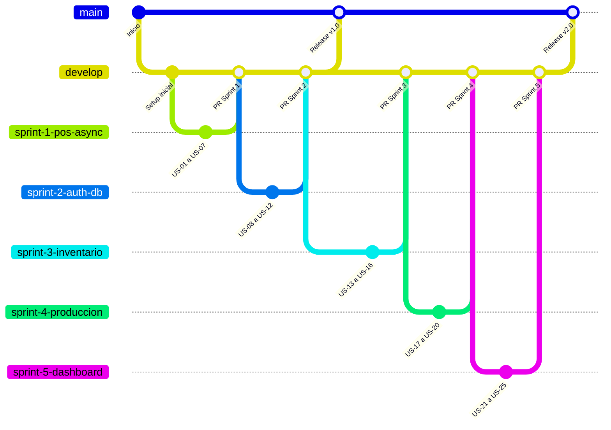

# Ingenieria-de-software-
## Distribución de Ramas y Estructuración de Versiones

> [!WARNING]
> **Para el Equipo de Desarrollo:** Este proyecto utiliza Git para el control de versiones alineado con nuestros Sprints (SCRUM). Sigan esta estructura estrictamente para evitar conflictos:
> 
> * **`main` (Producción):** Contiene únicamente versiones estables, probadas y listas para entregar a la panadería. **No hacer commits directos aquí.**
> * **`develop` (Integración):** Rama central de desarrollo. Todo código nuevo que se finalice en un Sprint debe integrarse aquí primero.
> * **`sprint-X-feature` (Desarrollo):** Para cada nueva tarea o épica (ej. `sprint-1-pos-async`), crea una rama con este formato a partir de `develop`. Al finalizar, envía un Pull Request hacia `develop`.

# 📋 Planificación SCRUM — Proyecto Panadería Amada Calero Leiva

> [!IMPORTANT]
> Este documento es la **hoja de ruta maestra** del proyecto. Todo el equipo debe leerlo antes de comenzar a programar. Cualquier cambio en el alcance debe ser aprobado por el Product Owner.

---

## 1. Definición de Roles SCRUM

| Rol | Persona | Responsabilidad |
|-----|---------|-----------------|
| **Product Owner** | Amada Calero Leiva (representada por un miembro del equipo) | Valida que cada función resuelva un problema real del negocio. Prioriza el backlog. |
| **Scrum Master** | Anderson | Elimina bloqueos técnicos, facilita ceremonias, protege al equipo de interrupciones. |
| **Equipo de Desarrollo** | Erick, Rodrigo, Jenniffer | Diseño de BD (SQL Server), API (Flask/Python), Frontend (HTML/CSS/JS). |

---

## 2. Product Backlog (Épicas del Sistema)

Ordenadas por **prioridad de negocio** (de mayor a menor valor para la panadería):

| # | Épica | Valor de Negocio | Sprint Estimado |
|---|-------|-------------------|-----------------|
| 1 | **Punto de Venta (POS)** — Venta de mostrador, facturación, encargos con ingredientes | 🔴 Crítico | Sprint 1 |
| 2 | **Autenticación y Roles de Usuario** — Login, permisos (Dependienta vs. Gerente) | 🔴 Crítico | Sprint 2 |
| 3 | **Control de Inventario** — Materia prima, rendimiento por lote, alertas de stock bajo | 🟠 Alto | Sprint 3 |
| 4 | **Monitor de Producción** — Sincronización Mostrador ↔ Horno, alertas de reposición | 🟡 Medio | Sprint 4 |
| 5 | **Dashboard Gerencial** — Reportes de ventas, cierres de caja, gráficas de rendimiento | 🟢 Deseado | Sprint 5 |

---

## 3. Desglose por Sprints (2 semanas cada uno)

---

### 🏃 Sprint 1 — "Núcleo del POS y Facturación"
**Objetivo:** Construir un Punto de Venta funcional donde la dependienta pueda vender productos de mostrador, registrar encargos personalizados (pasteles con ingredientes), y generar una factura con IVA. Todo sin que la pantalla se congele.

**Rama Git:** `sprint-1-pos-async` (desde `develop`)

| ID | Historia de Usuario | Tareas Técnicas | Criterio de Aceptación |
|----|---------------------|-----------------|------------------------|
| US-01 | Como dependienta, quiero ver un panel con los productos del mostrador para seleccionarlos rápidamente. | Maquetar interfaz HTML/CSS con tarjetas de productos (bolillos, pan pizza, milanesas). | La interfaz es responsiva y los botones son fáciles de tocar en pantalla táctil. |
| US-02 | Como dependienta, quiero que al registrar una venta la pantalla no se bloquee. | Programar evento con `Fetch API` para enviar el JSON en segundo plano. Mostrar spinner de carga. | La pantalla muestra un indicador de carga pero permite seguir interactuando. |
| US-03 | Como sistema, requiero recibir los datos de venta y almacenarlos de forma segura. | Crear endpoint `/api/factura` en Flask que reciba el JSON y lo guarde en SQL Server. | La BD refleja la transacción y la API responde con 200 OK. |
| US-04 | Como sistema, requiero una base de datos estable para iniciar operaciones. | Diseñar y ejecutar script SQL con tablas `Productos`, `Facturas`, `DetalleFacturas`, `Ingredientes`, `Encargos`. | Las tablas tienen PKs, FKs y normalización correcta. |
| US-05 | Como dependienta, quiero agregar productos al carrito y ver el subtotal, IVA (15%) y total en tiempo real. | Implementar lógica de carrito en JS con cálculo dinámico de IVA. | Al agregar/quitar productos, los montos se recalculan instantáneamente. |
| US-06 | Como dependienta, quiero seleccionar ingredientes extra al registrar un encargo (pastel). | Crear modal de personalización con checkboxes de ingredientes y recálculo de precio en vivo. | Al seleccionar ingredientes, el precio se suma al base y se refleja en el carrito con nombre descriptivo. |
| US-07 | Como dependienta, quiero registrar un adelanto parcial cuando el cliente hace un encargo. | Crear modal de encargo con campos: Adelanto, Saldo Pendiente (calculado), Fecha de Entrega. | El sistema calcula correctamente el saldo y almacena la fecha de entrega. |

> [!NOTE]
> **Estado actual:** Las historias US-01 a US-07 ya están implementadas en la rama `sprint-1-pos-async`. Falta la conexión real a SQL Server (actualmente usa datos simulados en Python).

---

### 🏃 Sprint 2 — "Autenticación, Roles y Conexión Real a BD"
**Objetivo:** Que cada usuario del sistema tenga un login propio, que las acciones estén restringidas según su rol, y que todas las transacciones se guarden en SQL Server real.

**Rama Git:** `sprint-2-auth-db` (desde `develop`)

| ID | Historia de Usuario | Tareas Técnicas | Criterio de Aceptación |
|----|---------------------|-----------------|------------------------|
| US-08 | Como gerente, quiero que cada empleado tenga su propio usuario y contraseña. | Crear tabla `Usuarios` (ID, Nombre, Email, PasswordHash, Rol). Crear página de Login. | El sistema permite iniciar sesión con credenciales válidas y rechaza las inválidas. |
| US-09 | Como gerente, quiero que la dependienta solo pueda acceder al POS y yo pueda ver todo. | Implementar middleware de autorización en Flask (`@login_required`, verificación de rol). | La dependienta ve solo el POS. El gerente ve POS + Inventario + Dashboard. |
| US-10 | Como sistema, necesito conectarme a SQL Server real para persistir las transacciones. | Configurar `pyodbc` con connection string en `config.py`. Reemplazar datos simulados por queries reales. | Al facturar, el registro aparece en la tabla `Facturas` de SQL Server. Al recargar, los productos se cargan desde la BD. |
| US-11 | Como dependienta, quiero que al facturar se genere un número de factura único y visible. | Generar número correlativo (ej. `FAC-0001`) al insertar en BD. Mostrarlo en el ticket/resumen después de facturar. | Cada factura tiene un número único, visible tras el procesamiento. |
| US-12 | Como gerente, quiero que el sistema registre qué usuario hizo cada venta. | Agregar columna `UsuarioID` a tabla `Facturas`. Asociar la sesión activa al registro. | Cada factura queda asociada al usuario que la registró. |

---

### 🏃 Sprint 3 — "Control de Inventario y Materia Prima"
**Objetivo:** Que la gerente pueda controlar cuánta materia prima tiene, cuánto rinde cada lote de producción, y recibir alertas cuando algo esté por acabarse.

**Rama Git:** `sprint-3-inventario` (desde `develop`)

| ID | Historia de Usuario | Tareas Técnicas | Criterio de Aceptación |
|----|---------------------|-----------------|------------------------|
| US-13 | Como gerente, quiero registrar la materia prima que compro (harina, huevos, azúcar, etc.). | Crear tabla `MateriaPrima` (ID, Nombre, Unidad, CantidadActual, StockMinimo, PrecioUnitario). Crear formulario de registro. | La gerente puede agregar, editar y ver la lista de materias primas con sus cantidades actuales. |
| US-14 | Como gerente, quiero que el sistema me avise cuando una materia prima esté por debajo de su stock mínimo. | Implementar consulta que compare `CantidadActual < StockMinimo`. Mostrar alerta visual en el dashboard. | Cuando la harina baja de su mínimo, aparece una alerta roja en la pantalla de inventario. |
| US-15 | Como gerente, quiero registrar la producción de un lote (ej. "Hoy se hicieron 200 bolillos con 25kg de harina"). | Crear tabla `Lotes` (ID, ProductoID, Cantidad, Fecha, MateriaPrimaUsada). Crear formulario de registro de producción. | Al registrar un lote, se descuenta automáticamente la materia prima usada del inventario. |
| US-16 | Como gerente, quiero ver cuánto rinde cada kilogramo de materia prima. | Calcular rendimiento: `Unidades Producidas / Kg Usados`. Mostrar en una tabla de reportes. | La pantalla de rendimiento muestra por producto cuántas unidades salen por kg de harina. |

---

### 🏃 Sprint 4 — "Monitor de Producción (Mostrador ↔ Horno)"
**Objetivo:** Que los panaderos en el horno sepan qué productos se están agotando en el mostrador, y que la dependienta sepa qué está saliendo del horno.

**Rama Git:** `sprint-4-produccion` (desde `develop`)

| ID | Historia de Usuario | Tareas Técnicas | Criterio de Aceptación |
|----|---------------------|-----------------|------------------------|
| US-17 | Como dependienta, quiero notificar al horno que un producto se está agotando en el mostrador. | Crear botón "Solicitar reposición" en el POS que envíe una alerta a la pantalla del horno. | Al presionar el botón, aparece una notificación en tiempo real en la pantalla del panadero. |
| US-18 | Como panadero, quiero ver en una pantalla qué productos necesitan reposición. | Crear vista `/monitor` que muestre las solicitudes de reposición ordenadas por urgencia. | La pantalla del horno muestra las solicitudes pendientes con hora y producto. |
| US-19 | Como panadero, quiero marcar un producto como "listo" cuando sale del horno. | Agregar botón "Listo" en el monitor que actualice el estado de la solicitud. | Al marcar como listo, la dependienta recibe una notificación de que el producto ya está disponible. |
| US-20 | Como gerente, quiero ver un historial de las solicitudes de reposición del día. | Crear tabla `Solicitudes` (ID, ProductoID, FechaHora, Estado). Crear vista de historial. | La gerente puede ver cuántas veces se solicitó reposición de cada producto en un rango de fechas. |

---

### 🏃 Sprint 5 — "Dashboard Gerencial y Cierres de Caja"
**Objetivo:** Que la gerente tenga visibilidad total del rendimiento del negocio con gráficas, reportes y cierre de caja diario.

**Rama Git:** `sprint-5-dashboard` (desde `develop`)

| ID | Historia de Usuario | Tareas Técnicas | Criterio de Aceptación |
|----|---------------------|-----------------|------------------------|
| US-21 | Como gerente, quiero ver las ventas totales del día, semana y mes. | Crear vista `/dashboard` con consultas agregadas por período. Renderizar con gráficas (Chart.js). | El dashboard muestra gráfica de barras con ventas diarias y un resumen con totales. |
| US-22 | Como gerente, quiero hacer un cierre de caja al final del día. | Crear endpoint `/api/cierre-caja` que sume todas las facturas del día. Crear tabla `CierresCaja`. | Al hacer cierre, el sistema muestra: Total Vendido, Total Facturas, Encargos Pendientes, Efectivo Esperado. |
| US-23 | Como gerente, quiero ver cuáles son los productos más vendidos. | Consulta SQL con `GROUP BY ProductoID ORDER BY SUM(Cantidad) DESC`. Mostrar en tabla y gráfica. | El dashboard muestra un ranking de los 10 productos más vendidos del período seleccionado. |
| US-24 | Como gerente, quiero ver el estado de los encargos pendientes. | Crear vista de encargos con filtros por estado (Pendiente, En Proceso, Entregado). | La gerente puede ver todos los encargos, su saldo pendiente y fecha de entrega. |
| US-25 | Como gerente, quiero exportar los reportes a PDF o Excel. | Implementar exportación con `reportlab` (PDF) o `openpyxl` (Excel). | Al presionar "Exportar", se descarga un archivo con los datos del reporte actual. |

---

## 4. Estructura de Ramas Git (Flujo de Trabajo)



### Reglas del Flujo

| Acción | Comando Git |
|--------|-------------|
| Crear rama de Sprint | `git checkout develop` → `git checkout -b sprint-X-feature` |
| Subir tu trabajo diario | `git add .` → `git commit -m "feat: descripción"` → `git push origin sprint-X-feature` |
| Integrar Sprint terminado | Crear **Pull Request** en GitHub de `sprint-X` → `develop`. Requiere revisión de al menos 1 compañero. |
| Liberar a producción | Crear **Pull Request** de `develop` → `main`. Requiere aprobación del Scrum Master. |

---

## 5. Ceremonias SCRUM

| Ceremonia | Frecuencia | Duración | Canal | Qué se hace |
|-----------|-----------|----------|-------|-------------|
| **Daily Stand-up** | Diaria (L-V) | 15 min | Discord / WhatsApp | Cada uno responde: ¿Qué hice ayer? ¿Qué haré hoy? ¿Tengo algún bloqueo? |
| **Sprint Planning** | Inicio de cada Sprint | 1 hora | Presencial o Zoom | Se revisan las historias del Sprint, se asignan tareas y se estiman tiempos. |
| **Sprint Review** | Final de cada Sprint | 30 min | Presencial | Se hace una **demo en vivo** del software funcionando. El Product Owner valida. |
| **Sprint Retrospective** | Después de la Review | 30 min | Presencial o Zoom | ¿Qué salió bien? ¿Qué salió mal? ¿Qué podemos mejorar para el próximo Sprint? |

---

## 6. Definición de "Hecho" (Definition of Done)

Una historia de usuario se considera **terminada** cuando cumple TODOS estos puntos:

- ✅ El código está en su rama de Sprint y compila sin errores.
- ✅ Cumple todos los criterios de aceptación de la historia.
- ✅ Fue probado manualmente por al menos un compañero del equipo.
- ✅ No tiene errores de consola (ni en el navegador ni en Flask).
- ✅ Fue subido a GitHub con un commit descriptivo.
- ✅ El Pull Request fue revisado y aprobado.

---

## 7. Arquitectura Técnica del Sistema

```
┌─────────────────────────────────────────────────────────┐
│                    NAVEGADOR WEB                         │
│  ┌──────────┐  ┌──────────┐  ┌──────────┐  ┌─────────┐ │
│  │   POS    │  │ Monitor  │  │Inventario│  │Dashboard│ │
│  │(Sprint 1)│  │(Sprint 4)│  │(Sprint 3)│  │(Sprint 5)│ │
│  └────┬─────┘  └────┬─────┘  └────┬─────┘  └────┬────┘ │
│       │              │              │              │      │
│       └──────────────┴──────────────┴──────────────┘      │
│                    Fetch API (JSON)                        │
└──────────────────────────┬──────────────────────────────┘
                           │ HTTP
┌──────────────────────────┴──────────────────────────────┐
│                   SERVIDOR FLASK                         │
│  ┌──────────┐  ┌──────────┐  ┌──────────┐  ┌─────────┐ │
│  │/api/venta│  │/api/stock│  │/api/lotes│  │/api/dash│ │
│  └────┬─────┘  └────┬─────┘  └────┬─────┘  └────┬────┘ │
│       │              │              │              │      │
│       └──────────────┴──────────────┴──────────────┘      │
│                     pyodbc (SQL)                          │
└──────────────────────────┬──────────────────────────────┘
                           │ TCP/IP
┌──────────────────────────┴──────────────────────────────┐
│                    SQL SERVER                             │
│  Productos │ Facturas │ Inventario │ Usuarios │ Lotes    │
└─────────────────────────────────────────────────────────┘
```

---

## 8. Cronograma General (10 semanas)

| Semana | Sprint | Entregable |
|--------|--------|------------|
| 1-2 | Sprint 1 | POS funcional con facturación, encargos e IVA |
| 3-4 | Sprint 2 | Login, roles, conexión real a SQL Server |
| 5-6 | Sprint 3 | Inventario de materia prima y alertas de stock |
| 7-8 | Sprint 4 | Monitor de producción Mostrador ↔ Horno |
| 9-10 | Sprint 5 | Dashboard gerencial, cierres de caja, reportes |

> [!TIP]
> **Recomendación:** Al finalizar el Sprint 2, hacer un **Release v1.0** a `main` (merge de `develop` → `main`). Esto le da a la panadería una versión usable mientras se siguen construyendo las demás funciones.

