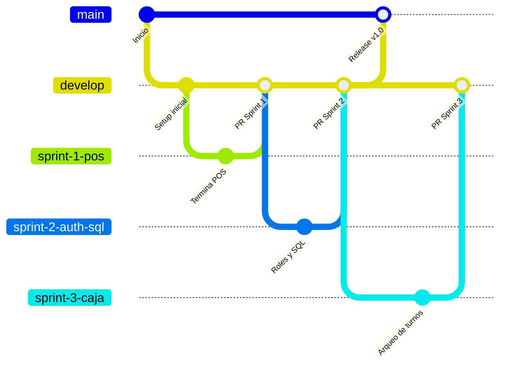

# UNIVERSIDAD NACIONAL DE INGENIERÍA
**Áreas de Conocimiento:** Tecnología de la Información y Comunicación  
**Asignatura:** Ingeniería de Software I  
**PROYECTO CORTE 1: UNIDAD I - TEORÍAS Y PRÁCTICAS**  

**Nombre:** [Tus Nombres] **Apellidos:** [Tus Apellidos] **Carnet:** [00000]  
**Carrera:** Ingeniería de Sistemas | **Grupo:** [000-SIS-S] | **Grupo de trabajo:** 1 | **Fecha:** [DD-MM-YYYY]  

---

> [!NOTE]
> **OBJETIVO GENERAL DE LA ASIGNATURA:** Desarrollar las fases de análisis y diseño del proceso de desarrollo de software, utilizando el Proceso Unificado de Rational (RUP), basado en el Lenguaje de Modelación Unificado (UML), con ética en la eficacia y eficiencia del producto y creación del software.

---

# 📚 PARTE 1: Documentación de la Unidad I (Fundamentos)

## 1. Título del Proyecto
**Sistema Integral de Gestión de Ventas, Producción y Contabilidad Privada para "Panadería Amada"**

## 2. Planteamiento del Problema (Enfoque Interdisciplinario)
La "Panadería Amada" carece de un sistema informático, gestionando sus operaciones (pedidos, caja, inventario) mediante cuadernos físicos y uso informal de WhatsApp. Esto provoca vulnerabilidad de la información confidencial, demoras y falta de control.

* **Integración con Contabilidad:** La gerencia necesita registrar estrictamente el arqueo diario ("Venta Neta"), controlar los pagos mixtos (efectivo vs. transferencias), registrar facturas formales con RUC, cobrar anticipos del 50% contra entrega, y manejar cuentas privadas de egresos (vales de empleados y pago a proveedores). Al estar en papel, el cuadre de turnos es ineficiente y propenso al robo o error humano.
* **Integración con Estadística:** No existen datos precisos para proyectar el rendimiento de la materia prima (ej. cuántos bolillos se producen matemáticamente por cada saco de harina) ni estadísticas de ventas que permitan rankear los productos más demandados. Además, se requiere categorizar probabilísticamente a los clientes (nuevos, frecuentes, VIP) basándose en su frecuencia de compra.

## 3. Prototipo y Módulos del Sistema
El sistema se dividirá en módulos interconectados, respetando la estructura operativa de la empresa:

* **Módulo de Ventas (Mercadotecnia y POS):** Ventas de mostrador, cotizador de pasteles (incluyendo pasteles ficticios al 70%), catálogo online responsivo y generación de enlaces de pedido para WhatsApp.
* **Módulo de Finanzas y Contabilidad:** Control de apertura/cierre de turnos (Arqueo), registro de "Venta Neta", vales de empleados, flujo de ingresos y egresos, y generación de Backups (respaldos de seguridad).
* **Módulo de Producción:** Monitor en tiempo real para sincronizar mostrador y horno, y control de stock de materia prima.
* **Creación de Base de Datos:** Esquema centralizado en SQL Server para unificar los módulos garantizando integridad referencial.

### Jerarquía de Permisos de Usuario (RBAC)
Para proteger la privacidad exigida por la dueña, el sistema se rige por permisos estrictos:
1. **Superadministrador (Desarrolladores):** Control total de la base de datos, configuraciones del servidor y mantenimientos técnicos.
2. **Administrador (Doña Amada - Gerente):** Acceso total al negocio. Único perfil autorizado para entrar al Módulo de Contabilidad, ver reportes de flujo de caja y crear/eliminar usuarios.
3. **Usuario Estándar (Dependientas):** Tareas diarias limitadas. Solo pueden usar el Punto de Venta (POS) y realizar el "Arqueo de Caja" de su turno. No ven reportes globales.
4. **Usuario Restringido / Invitado (Panaderos y Clientes):** Panaderos solo ven la pantalla del Monitor. Clientes solo acceden al Catálogo Web para ver precios.

## 4. Análisis de Metodologías y Modelos
Basado en los apuntes de la clase (Briano_compilacion_apuntes), el desarrollo se rige por:

* **Metodologías Seleccionadas:** **Metodologías Ágiles (SCRUM) y Desarrollo Web.** Se descartan las *metodologías robustas o tradicionales* porque el cliente solicitó revisión continua ("vendríamos a enseñarle los avances semana a semana y usted nos dice cámbienle esto"). SCRUM permite esa flexibilidad para alterar diseños y reglas sobre la marcha.
* **Modelos Seleccionados:** **Modelo de Desarrollo Evolutivo (Iterativo y Prototipos).** Se descarta el *Modelo de Cascada* porque los requerimientos evolucionarán. Presentaremos prototipos de interfaz (validando la paleta Marfil, Chocolate, Dorado) y liberaremos versiones funcionales progresivas (Incrementales).

---

# 🚀 PARTE 2: Planificación SCRUM y Estructura Técnica

> [!WARNING]
> **Para el Equipo de Desarrollo:** Este proyecto utiliza Git para el control de versiones alineado con nuestros Sprints.
> * **`main` (Producción):** Solo versiones estables. **No hacer commits directos aquí.**
> * **`develop` (Integración):** Rama central. Todo código de un Sprint finalizado entra aquí.
> * **`sprint-X-feature`:** Rama temporal para desarrollar (ej. `sprint-1-pos`).

## 1. Roles SCRUM
| Rol | Persona | Responsabilidad |
|-----|---------|-----------------|
| **Product Owner** | Amada Calero (repr. por un alumno) | Valida que cada función resuelva un problema real del negocio. |
| **Scrum Master** | Anderson | Facilita ceremonias, protege al equipo de bloqueos. |
| **Equipo de Desarrollo** | Erick, Rodrigo | Diseño de BD (SQL Server), API (Flask), Frontend. |

## 2. Product Backlog (Prioridad de Negocio)
| # | Épica | Prioridad | Sprint |
|---|-------|-----------|--------|
| 1 | **POS, Anticipos 50/50 y Gestión de Pagos** | 🔴 Crítico | Sprint 1 |
| 2 | **Seguridad, Autenticación y Conexión SQL** | 🔴 Crítico | Sprint 2 |
| 3 | **Cierres de Caja, Arqueos y Venta Neta** | 🔴 Crítico | Sprint 3 |
| 4 | **Catálogo Online y CRM de Clientes (WhatsApp)** | 🟠 Alto | Sprint 4 |
| 5 | **Contabilidad Privada, Vales y Backups BD** | 🟠 Alto | Sprint 5 |
| 6 | **Monitor de Producción e Inventario** | 🟡 Medio | Sprint 6 |

## 3. Desglose por Sprints (Modelo Iterativo/Incremental)

### 🏃 Sprint 1 — "POS y Lógica de Negocio (Anticipos)"
* **Objetivo:** Construir el POS funcional para mostrador, cobrar encargos exigiendo el 50% de anticipo, calcular pasteles ficticios (70%) y elegir el método de pago.
* **Rama:** `sprint-1-pos`

### 🏃 Sprint 2 — "Seguridad y Roles de Usuario"
* **Objetivo:** Restringir el sistema (Login). La dependienta no debe ver la contabilidad. Conexión real a SQL Server para guardar las facturas. Diferenciar si se imprime con o sin RUC.
* **Rama:** `sprint-2-auth-sql`
* *(Hito: Lanzamiento Release v1.0 a Main)*

### 🏃 Sprint 3 — "Arqueos y Control de Turnos"
* **Objetivo:** Digitalizar el proceso de turnos. La dependienta declara la "Venta Neta", separa efectivo de transferencias y la gerente lo aprueba al final del día.
* **Rama:** `sprint-3-caja`

### 🏃 Sprint 4 — "CRM y Catálogo Web"
* **Objetivo:** Crear la tabla Clientes para identificar fidelidad (CRM). Lanzar el catálogo online móvil (`/catalogo`) donde los clientes armen su pedido y envíen la orden pre-formateada por WhatsApp.
* **Rama:** `sprint-4-crm-web`

### 🏃 Sprint 5 — "Contabilidad Privada y Seguridad de Datos"
* **Objetivo:** Módulo oculto para la Gerente. Registrar egresos, vales de empleados y generar un Script de automatización de **Backups** nocturnos de SQL Server.
* **Rama:** `sprint-5-admin-backups`
* *(Hito: Lanzamiento Release v2.0 a Main)*

## 4. Distribución de Ramas (Git Flow)



## 5. Ceremonias SCRUM y "Definition of Done"
* **Ceremonias:** Daily Stand-up (15m diarios en Discord), Sprint Planning, Sprint Review (demo a Doña Amada), Sprint Retrospective.
* **Definition of Done (DoD):** El código compila, cumple la paleta de colores (Marfil, Chocolate, Dorado), fue probado por un usuario "Estándar" para comprobar que no evade la seguridad, el Pull Request fue aprobado y no hay errores de consola.

## 6. Arquitectura Técnica
```text
┌─────────────────────────────────────────────────────────┐
│                    NAVEGADOR WEB                        │
│  ┌──────────┐  ┌──────────┐  ┌──────────┐  ┌─────────┐  │
│  │   POS    │  │ Catálogo │  │  Cajas   │  │Contable │  │
│  └────┬─────┘  └────┬─────┘  └────┬─────┘  └────┬────┘  │
│       └─────────────┴─────────────┴─────────────┘       │
│                    Fetch API (JSON)                     │
└──────────────────────────┬──────────────────────────────┘
                           │ HTTP / Autenticado (Roles)
┌──────────────────────────┴──────────────────────────────┐
│                   SERVIDOR FLASK (Python)               │
│               pyodbc (Seguridad Anti-SQLi)              │
└──────────────────────────┬──────────────────────────────┘
                           │ TCP/IP
┌──────────────────────────┴──────────────────────────────┐
│                    SQL SERVER                           │
│  Productos | Usuarios | Facturas | Turnos | Backups     │
└─────────────────────────────────────────────────────────┘
```

> [!TIP]
> **Próximos Pasos para la Clase:** Este documento cubre la totalidad del "Corte 1" e instaura la base metodológica. Para los siguientes cortes, sobre esta misma estructura agregaremos los diagramas UML, casos de uso formales (RUP) y métricas de calidad de software requeridas en las unidades II y III.
