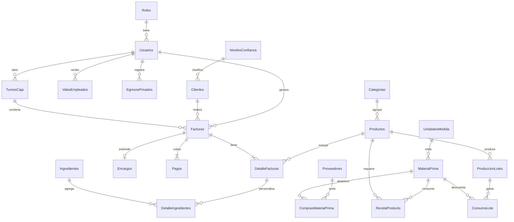

# 🗄️ Base de Datos — Panadería Amada

## Descripción General

Esta carpeta contiene el esquema relacional completo del sistema de gestión de la Panadería Amada. La base de datos está diseñada con **normalización en Tercera Forma Normal (3FN)** para SQL Server, garantizando integridad referencial, seguridad por roles y trazabilidad contable.

**Total: 21 tablas | 9 índices | 4 CHECK constraints**

---

## Cómo Ejecutar

1. Abrir **SQL Server Management Studio (SSMS)**.
2. Abrir el archivo `esquema.sql`.
3. Presionar **F5** para ejecutar.

El script crea la base de datos `PanaderiaDB` automáticamente si no existe, elimina las tablas anteriores (si las hay) y las vuelve a crear con los datos de prueba incluidos.

---

## Diagrama Entidad-Relación

---

## Estructura de Tablas por Módulo

### 1. Tablas Catálogo (4 tablas)

Centralizan valores de configuración que se referencian desde otras tablas.

| Tabla | Propósito | Ejemplo de Datos |
|-------|-----------|------------------|
| `Roles` | Permisos del sistema (RBAC) | SuperAdmin, Admin, Estándar, Invitado |
| `Categorias` | Clasificación de productos | Pan Salado, Pan Dulce, Repostería, Bebidas |
| `NivelesConfianza` | Fidelidad del cliente (con umbral de compras) | Nuevo (0), Frecuente (3+), VIP (10+) |
| `UnidadesMedida` | Unidades para materia prima | Kg, Lt, Ud, Lb, g |

### 2. Seguridad y CRM (2 tablas)

| Tabla | Propósito | Columnas Clave |
|-------|-----------|----------------|
| `Usuarios` | Login y control de acceso | `Username`, `PasswordHash`, `RolID` → Roles |
| `Clientes` | Cartera de clientes con historial | `NivelConfianzaID`, `TotalCompras` (se incrementa automáticamente) |

### 3. Ventas y Pagos (8 tablas)

| Tabla | Propósito | Relaciones |
|-------|-----------|------------|
| `Productos` | Catálogo de lo que se vende | `CategoriaID` → Categorías. `EsFicticio` = pasteles al 70% |
| `Ingredientes` | Extras para personalizar pasteles | Rellenos, coberturas, cake toppers |
| `TurnosCaja` | Arqueo **100% automático** | El sistema calcula `EfectivoCalculado` y `TransferenciasCalculadas` |
| `Facturas` | Registro principal de cada venta | `TurnoID` vincula al turno activo. `EsEncargo` / `IncluyeRUC` (BIT) |
| `DetalleFacturas` | Líneas del carrito | `PrecioUnitario` congelado al momento de vender |
| `DetalleIngredientes` | Qué extras se pidieron en cada línea | Tabla puente entre `DetalleFacturas` ↔ `Ingredientes` |
| `Pagos` | Abonos por factura (soporta 50/50) | `MetodoPago` CHECK: 'Efectivo' o 'Transferencia' |
| `Encargos` | Extensión de factura para pedidos futuros | `Estado` CHECK: Pendiente → En Proceso → Listo → Entregado |

> **¿Cómo funciona el pago 50/50?** Una factura de encargo genera 2 registros en `Pagos`: uno con el 50% de anticipo (Efectivo) y otro con el 50% contra entrega (Transferencia).

### 4. Contabilidad Privada (2 tablas)

Solo accesibles por el rol **Admin** (Doña Amada).

| Tabla | Propósito |
|-------|-----------|
| `EgresosPrivados` | Gastos del negocio (proveedores, servicios, gas) |
| `ValesEmpleados` | Préstamos a empleados. `EmpleadoID` → Usuarios. `Descontado` indica si ya se cobró |

### 5. Inventario y Producción (5 tablas)

| Tabla | Propósito | Detalle |
|-------|-----------|---------|
| `Proveedores` | A quién se le compra | Nombre, Teléfono |
| `MateriaPrima` | Stock actual de insumos | `StockMinimo` dispara alertas cuando `StockActual` baja |
| `ComprasMateriaPrima` | Registro de compras a proveedores | Vincula `MateriaPrimaID` ↔ `ProveedorID` |
| `RecetaProducto` | Fórmula teórica de cada producto | Ej: 1 Bolillo = 0.05 Kg Harina + 0.02 Ud Huevo |
| `ProduccionLotes` | Lo que se horneó en cada tanda | Cantidad producida por producto |
| `ConsumoLote` | Lo que realmente se gastó en un lote | Permite comparar consumo real vs receta teórica |

> **¿Por qué RecetaProducto y ConsumoLote por separado?** `RecetaProducto` es la fórmula ideal. `ConsumoLote` es lo que realmente se usó. La diferencia entre ambos revela desperdicios o robos de materia prima.

---

## Constraints y Validaciones

| Constraint | Tabla | Regla |
|------------|-------|-------|
| `CK_Pagos_MetodoPago` | Pagos | Solo permite 'Efectivo' o 'Transferencia' |
| `CK_Encargos_Estado` | Encargos | Solo permite 'Pendiente', 'En Proceso', 'Listo', 'Entregado' |
| Todas las FK | Varias | Nombradas explícitamente (ej. `FK_Productos_Categorias`) para fácil depuración |

---

## Datos de Prueba Incluidos

El script inserta automáticamente:
- **4 roles** del sistema
- **6 categorías** de productos
- **3 niveles** de confianza de clientes
- **5 unidades** de medida
- **3 usuarios** (Doña Amada + 2 dependientas)
- **13 productos** reales de la panadería
- **6 ingredientes** extras para pasteles
- **1 cliente** genérico de mostrador
